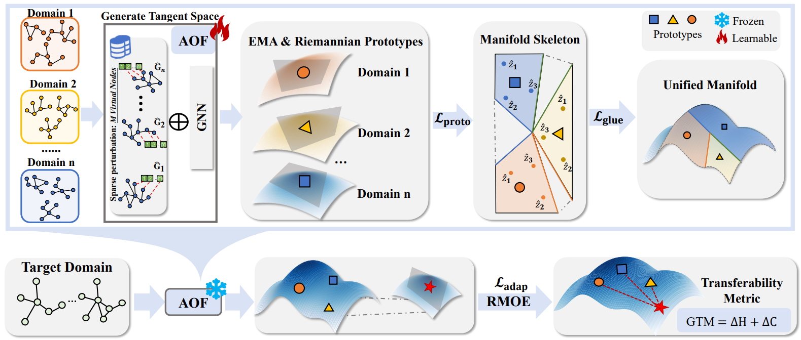
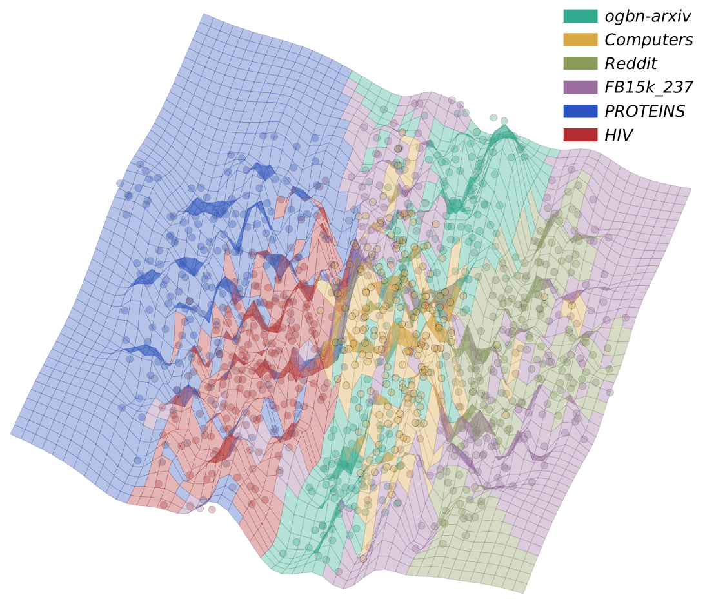

# GraphGlue: Multi-Domain Transferable Graph Gluing for Building Graph Foundation Models


## Get Started


To run the pretraining, please using the following command:
```shell
python main.py --run_type pretrain \
 --pretrain_single_graph_data ${SINGLE_GRAPH_DATASETS_LIST} \
 --pretrain_multi_graph_data ${MULTI_GRAPH_DATASETS_LIST}
```
You need to replace ```${SINGLE_GRAPH_DATASETS_LIST}``` 
and ```${MULTI_GRAPH_DATASETS_LIST}```
with lists of graph dataset names. 
For instance, ```[ogbn-arxiv, Reddit, FB15k_237]```  and ```[PROTEINS, HIV]```.

To run the adaptation for few-shot transferring, please using the following command:
```shell
python main.py --run_type adapt \
 --pretrain_single_graph_data ${SINGLE_GRAPH_DATASETS_LIST} \
 --pretrain_multi_graph_data ${MULTI_GRAPH_DATASETS_LIST} \
 --pretrained_checkpoint checkpoints/pretrain/${SINGLE_GRAPH_DATASETS_LIST}_${MULTI_GRAPH_DATASETS_LIST}/${MODEL_NAME}.pth \
 --data_name ${DATA_NAME} \
 --task_type ${TASK_TYPE} \
 --metric ${METRIC}$ \
 --k_shot $K_SHOT$
```
You need to replace ```${MODEL_NAME}``` 
with the file name of checkpoint that needed to use;
```${DATA_NAME}``` with the dataset name for transfer, e.g., ```Computers```;
```${TASK_TYPE}``` with ```node_cls, graph_cls, link_cls```;
```${METRIC}$``` with ```acc``` or ```auc```;
```$K_SHOT$``` with ```1, 5``` or other number you want to transfer.

## GraphGlue FrameWork
<div align=center>

</div>
<div align=center>
Figure 1. An Illustration of GRAPHGLUE Framework
</div>

## Visualization of Glued Manifold
<div align="center">

</div>
<div align=center>
Figure 2. Visualization of the pre-trained manifold from 6 datasets.
</div>